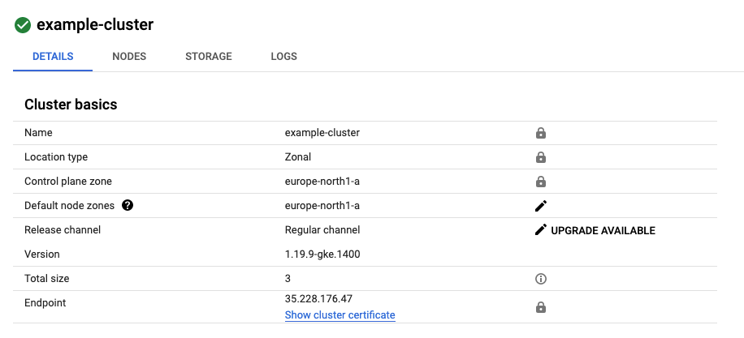
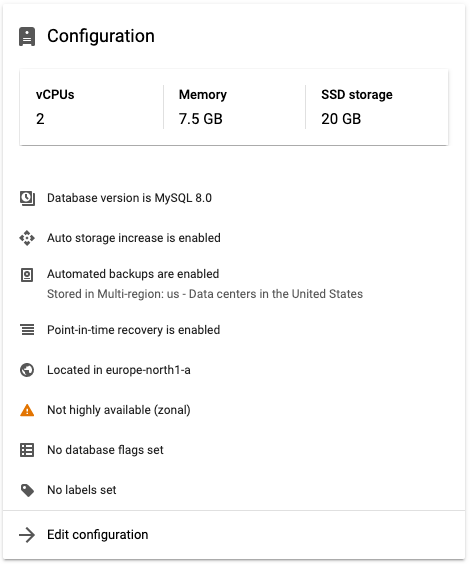
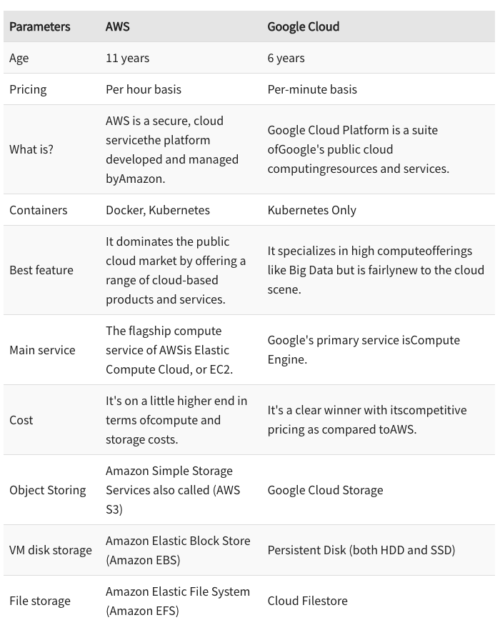

<h1 align="center">
 
 Google Cloud takes care of everything
</h1>

## Description

As I said before, we need a place where we can run all services at and that place is Google CLoud Platform.
Cloud is simply a set of tools that help programmers concentrate on writing code and not where to 
run it and how to vertically/horizontally scale it. Cloud provides ready-to-run 
VM-instances, remote DB, MQ-Services and many other tools. In Logiweb Microservices I used GKE, Google Cloud SQL and Google PUB/SUB services

<!-- https://shields.io/ -->

## Google Kubernetes Engine
I created a cluster with 3 nodes (VM instances) in it. Those nodes are considered as one whole. 
It means that I don't need to know hot to establish connection between them in order to successfully run my project.

All the deployments I describe in the previous section go and run here.

## Google Cloud SQL
Using Google Cloud SQL (MySQL) instead of deploying my own database as a service, 
I get rid of most of the problems: Scaling, Supporting, Recovering. Google will take care of it.

## Google Pub/Sub
This is a great alternative to RabbitMQ & ActiveMQ. The difference is, the broker is Google itself. 
It stores messages to remote Data store volume and sends it to subs whenever they're ready.

## Why not Amazon Web Services?
It's important to note that my project was running on AWS first, but since Amazon doesn't provide free trial for 
some of its services (e.g. Amazon EKS, Amazon MQ), I decided to migrate to Google completely.

#### Key differences

#### What are the alternatives?
While working with Amazon, I used services such as EKS, MQ, EC2, RDS. Fortunately, I found all needed alternatives in Google Cloud.
Those are GKE, Pub/Sub, Compute Engine and Google Cloud SQL respectively.

#### What are my feelings?
Despite of Amazon being more popular, I found Google more user-friendly, since it has a UI where I can configure all the services. 
Also, It provides a free trial account. During free trial you can't use paid services (You will have to activate commercial account).
On the other hand, Amazon does not do that. 
Instead, it offers some free hours on a couple of services, but you can easily
use any services which will be on the bill list immediately.