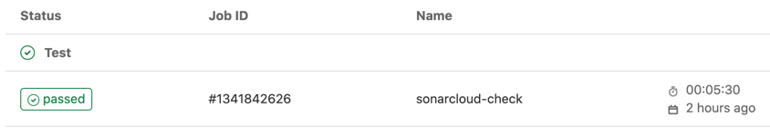
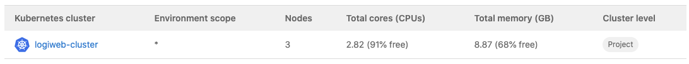
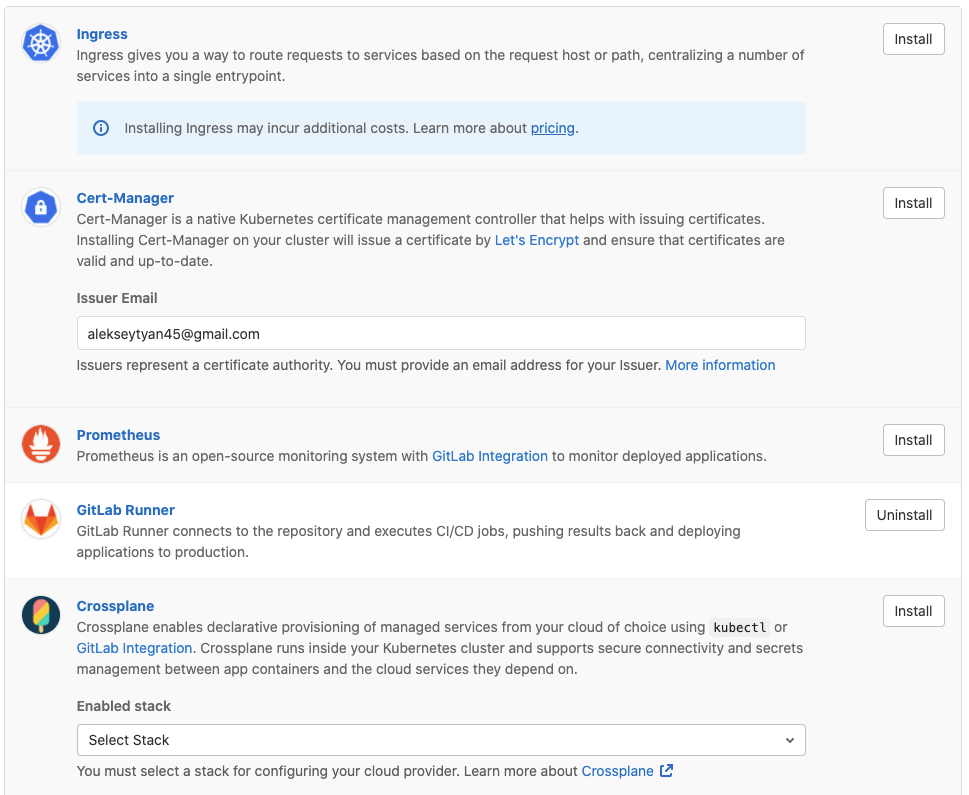

<h1 align="center">
<br>
<br>GitLab is better for DevOps
</h1>

## Description

<p>The bigger my project was getting, the more it was clear that I would need some help in DevOps-ing.
Luckily, we've got GitLab which support CI/CD, integrations to GKE/EKS and other useful services. 
With GitLab it's much easier to deploy application to production stage</p>

<!-- https://shields.io/ -->

## CI/CD
I have created .gitlab-cy.yml file where I configured what how remote runners will build my project.
Simply put, project will build and tests will be invoked. After that, the project is being analyzed and the result goes to sonar cloud.
Here's the file:
```yaml
variables:
  SONAR_USER_HOME: "${CI_PROJECT_DIR}/.sonar"  # Defines the location of the analysis task cache
  GIT_DEPTH: "0"  # Tells git to fetch all the branches of the project, required by the analysis task
sonarcloud-check:
  image: maven:3.6.3-jdk-11
  cache:
    key: "${CI_JOB_NAME}"
    paths:
      - .sonar/cache
  script:
    - mvn verify sonar:sonar
  only:
    - merge_requests
    - master-p2
    - develop
```

After that, I can see the result of the job:
<br>


## Connect to Google Kubernetes Engine

In order to synchronize my project with remote cluster, I connected to it with GitLab k8s support:


Now many options are available for me to use:
