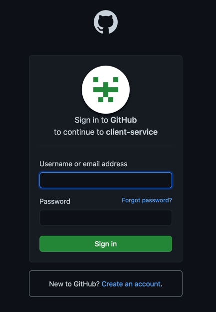

<h1 align="center">

 Client Service
</h1>

## Description
This is where end-user can make an order and check its status until it's ready.
When user submit new order, it proceeds to main application where the order is stored.
Now, any order changes will be synchronized with this application, 
so that user can see real-time delivery status.
<!-- https://shields.io/ -->

## Project structure
<dl>
<li>This is the third microservice which means that it will not work without connection to the main application.</li>
<li>Like Logiweb service, this application has MVC structure, so that it uses its own database.</li>
<li>Client order service interact with the main application through REST-endpoints.</li>
</dl>

## Registration & Authentication
In order to register, user must log in first via GitHub. I used Spring OAuth2.0 for that.
Once authenticated, the user will automatically be registered (Only after very 1st login)
and have additional functionality (Like making new order).

## Technology stack
<dl>
<li>Spring Boot</li>
<li>Google Cloud SDK</li>
<li>JPA</li>
<li>MySQL</li>
<li>JSP</li>
<li>Tomcat</li>
</dl>

