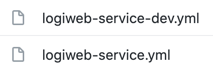

<h1 align="center">
<br>
<br>Spring Cloud Configuration Server
</h1>

## Description

<p>
The last but not least microservice is Centralized Config Service which is a great tool for storing 
properties of all services in one place, so that it's easier to maintain. This is done by using Spring Cloud.
</p>

<!-- https://shields.io/ -->

## Project structure

This is a microservice, but it does not store the data itself. 
Instead, a private Git repository is used, so that anonymous users cannot access the data.

Here's how you can enable Spring Cloud Config Server:
```java
@SpringBootApplication
@EnableConfigServer
public class ConfigService {
    public static void main(String[] args) {
        SpringApplication.run(ConfigService.class, args);
    }
}
```

application.yml:
```yaml
server:
  port: 8888
spring:
  cloud:
    config:
      server:
        git:
          uri: ${GIT_CONFIG_URI}
          searchPaths: logiweb-service, client-order-service,chat-service

# enable all actuator endpoints for testing (review this for real deployments)
management.endpoints.web:
  include: '*'
```

## Spring Profiles
When developing and testing, I don't need to connect to remote database and related services. 
What I need is to run the whole project locally, but how can I do that? I surely don't want to write the 2nd project with slightly different configuration. 
This is the exact case what Spring Profiles were created for. 
<br>
In my project I have two profiles:
*Default* (For production) and *Dev*. *Default* profile keeps all the properties for connecting to remote set services (DB, GCP, etc), 
while *Dev* keeps properties for another services (They also might be remote, they're just not the same, this is the point).

Here's how it looks like:
<br>
<br>

<br>

One of them will be chosen automatically at runtime according to running command. 
Now, all I need to do is to pass command `-Dspring-boot.run.profiles=default` after `java -jar` 
in order to run my application with *default* profile.

## Technology stack
<dl>
<li>Spring Boot</li>
<li>Spring Cloud</li>
</dl>

