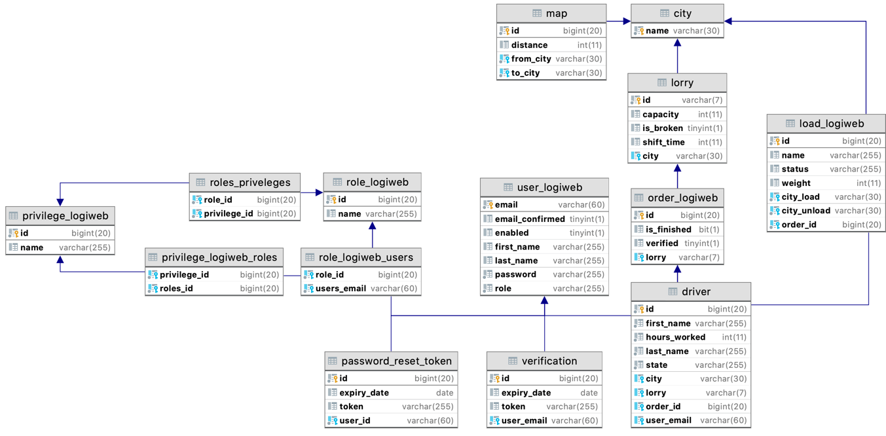
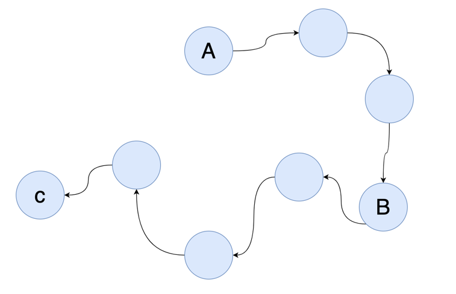
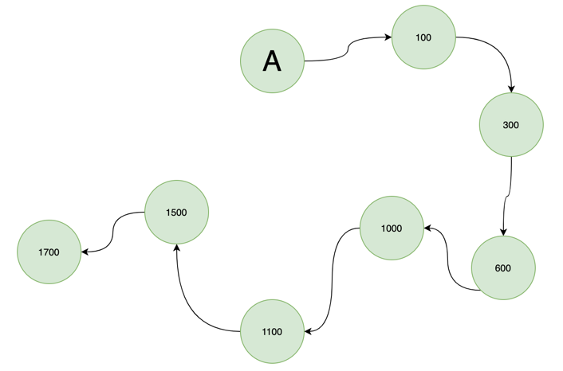
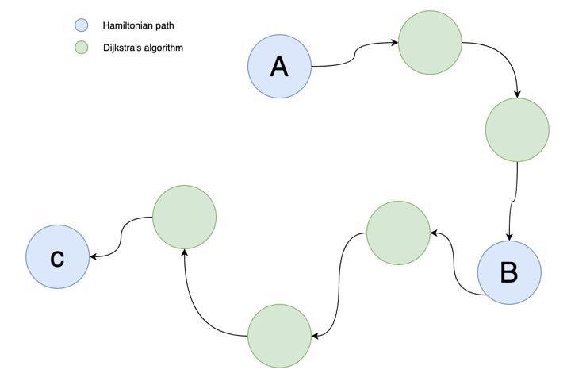

<h1 align="center">
<br>
<br>Main Logiweb Application
</h1>

## Description

<dl>
<li>This is the main application and all the microservices depend on it.</li>
<li>The platform aims to facilitate the management of cargo transportation.</li>
<li>It's only created for use within company, it's being used only by staff, 
but we have another application called 'Client Service' where users and clients may make orders. As you might guess, 
that app interact with Logiweb Service.</li>
</dl>

<!-- https://shields.io/ -->

## Technical requirements
<dl>
<li>It is required to develop a multi-user client-server application with a network connection.</li>
<li>All data must be stored on the server side. Each client can download some data, after each change operation, the data must be synchronized with the server.</li>
<li>The client must have a UI.</li>
<li>The application must handle hardware and software errors.</li>
</dl>

## Project structure

As in any Web Application, there are three main tiers. 
Those are Model, View & Controller, each has its own set of packages and related resources.

#### Model
I use MySQL as main data source and not Postgres and here's why:<br>
<dl>
<li>Postgres is still less popular than MySQL (despite catching up in recent years), 
so there’s a smaller number of 3rd party tools, or developers/database administrators available.</li>
<li>Postgres forks a new process for each new client connection which allocates 
a non-trivial amount of memory (about 10 MB).</li>
<li>Postgres is built with extensibility, standards compliance, scalability, and data integrity in mind - 
sometimes at the expense of speed. Therefore, for simple, read-heavy workflows, 
Postgres might be a worse choice than MySQL.</li>
</dl>

Here you can see my ERM (Entity Relationship Diagram) of my MySQL schema:


In order to access the data, I use JPA (Hibernate) and DAO & Service tiers from Spring MVC.
#### Controller

As a controller tier, I use standard Spring MVC controllers support

#### View

On the frontend side I use JSP, JavaScript & Bootstrap technologies

## Registration

<dl>
<li>In logiweb service I implemented TWO-Factor registration process which means that user cannot 
just enter their credentials and get access to the platform. In order to complete the registration, 
an email is sent to confirm the form. Then, administrator need to apply new user. 
Only after these two steps, the user can successfully use my platform.</li>
<li>If user has provided username that already exist, he will not be registered. 
Instead, the message "User already exists" is shown.</li>
</dl>

## Authentication

<dl>
<li>As long as administrator doesn't apply them, user will see "Account hasn't been activated yet" 
message on login page.</li>
<li>Brute-force-login protection: User will be banned by IP address after 10 failed attempts.</li>
</dl>


## Scheduled tasks:

In Logiweb application there are a couple of task that run asynchronously in order to do some backgrounds jobs. 
Those might be:
<dl>
<li>Cleaning database from registration/verification tokens</li>
<li>Email notification (To be implemented...)</li>
<li>Anything else</li>
</dl>

Here is 2 different kind of tasks:


<dl>
<li>
This one executes in async every Monday & Friday at 11 P.M. Its purpose is to clean verification tokens 
(ones, that are created when user go through registration process):
```java
@Async
@Scheduled(cron = "0 0 23 * * MON,FRI")
public void scheduledTask() {
    verificationService.deleteAll();
}
```
</li>

<li>
And this task executes after fixed delay (After 3 day, to be precise). Here's its configuration:
```java
@Configuration
@EnableAsync
@EnableScheduling
public class SchedulingConfig {
    @Bean
    public ThreadPoolTaskScheduler threadPoolTaskScheduler(){
        ThreadPoolTaskScheduler threadPoolTaskScheduler
                = new ThreadPoolTaskScheduler();
        threadPoolTaskScheduler.setPoolSize(5);
        threadPoolTaskScheduler.setThreadNamePrefix(
                "ThreadPoolTaskScheduler");
        return threadPoolTaskScheduler;
    }
}
```

Now, in order to call it, I need to inject ThreadPoolTaskScheduler bean into a class and call:
```java
registerScheduler.scheduleWithFixedDelay(() -> 
        userService.deleteIfUnconfirmed(userDto.getEmail()), 259200000
);
```
</li>
</dl>

## Pathfinding algorithm

Combination of Hamiltonian Path & Dijkstra's algorithms was used in order to find needed path between given set of cities.
By using these two together, I managed to decrease time complexity.

#### Hamiltonian path

Let's say we have 3 cities we need to visit and some cities between these three:


By using Hamiltonian Path algorithm, we can find all routes from starting point 
(A) that visit each node exactly once. 
On the picture above, there are 8 nodes (cities), each will have to be visited according to the algorithm logic.
This is a perfect algorithm, the only problem is its time and space complexity - *O(N^2\*N!)*. 
**So, for 8 cities algorithm will work as O(8^2*8!) = 2580480.**
<br>Not only is this not good for performance, it's not commonly used in real world computing. 
Instead, more complex and pre-computed algorithms are being used to calculate routes. 
But, since we are not in real world, we need to find something simple that will help us out. 
This is where Dijkstar's algorithms comes into play

#### Dijkstra's algorithm
Dijkstra's algorithm is a primary algorithm used for calculate 
minimal route from a given node to every other in the set. It's time complexity is O(N^2), 
furthermore, it can be dropped down to O(N + E*log(N)) when using priority-queue.

Here's an example:

So, we have set of 8 cities with the starting point A, now we have distance from A to every other node in the set.
**The result is O(8^2) = 64.**

#### How it works together?
Now that we have an algorithm that finds all possible routes in a given set of cities, and algorithm that find minimal distance between those cities, we can combine them:

Now, we don't need to calculate all possible routes between 8 cities, just 3 of them (Again, ones that we need to visit). Once the order of initial cities is calculated, 
we call Dijkstra's algorithm to find minimal distance between initial cities (from A to B, from B to C).

So, by doing a little math we can now come to a conclusion that **the final time complexity is O(3^2\*3!)\*O(8^2) = O(3^2\*3!\*8^2) = 3456** which is much better than **2580480**

## Technology stack
<dl>
<li>Spring Framework (Core, Boot, Data, Cloud)</li>
<li>Google Cloud SDK</li>
<li>JPA</li>
<li>MySQL</li>
<li>JSP</li>
<li>Tomcat</li>
</dl>

