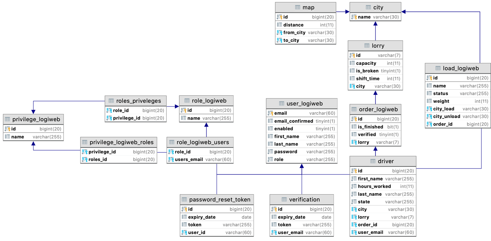

<h1 align="center">

 Logiweb
</h1>

## Description

This is the main application and all the microservices depend on it.
 
The platform aims to facilitate the management of cargo transportation

<!-- https://shields.io/ -->

## Technical requirements
<ol>
<li>It is required to develop a multi-user client-server application with a network connection.</li>
<li>All data must be stored on the server side. Each client can download some data, after each change operation, the data must be synchronized with the server.</li>
<li>The client must have a UI.</li>
<li>The application must handle hardware and software errors.</li>
</ol>

## Project structure

As in any Web Application, there are three main tiers. 
Those are Model, View & Controller, each has its own set of packages and related resources.

#### Model
I use MySQL as main data source and not Postgres and here's why: 
<dl>
<li>Postgres is still less popular than MySQL (despite catching up in recent years), 
so there’s a smaller number of 3rd party tools, or developers/database administrators available.</li>
<li>Postgres forks a new process for each new client connection which allocates 
a non-trivial amount of memory (about 10 MB).</li>
<li>Postgres is built with extensibility, standards compliance, scalability, and data integrity in mind - 
sometimes at the expense of speed. Therefore, for simple, read-heavy workflows, 
Postgres might be a worse choice than MySQL.</li>
</dl>

Here you can see my ERM (Entity Relationship Diagram) of my MySQL schema:

In order to access the data, I use JPA (Hibernate) and DAO & Service tiers from Spring MVC.
#### Controller

As a controller tier, I use standard Spring MVC controllers support

#### View

On the frontend side I use JSP, JavaScript & Bootstrap technologies

## Registration

<dl>
<li>In logiweb service I implemented TWO-Factor registration process which means that user cannot 
just enter their credentials and get access to the platform. In order to complete the registration, 
an email is sent to confirm the form. Then, administrator need to apply new user. 
Only after these two steps, the user can successfully use my platform.</li>
<li>If user has provided username that already exist, he will not be registered. 
Instead, the message "User already exists" is shown.</li>
</dl>

## Authentication

<dl>
<li>As long as administrator doesn't apply them, user will see "Account hasn't been activated yet" 
message on login page.</li>
<li>Brute-force-login protection: User will be banned by IP address after 10 failed attempts.</li>
</dl>

## Pathfinding algorithm

Hamiltonian Path & Dijkstra's algorithms were used in order to find needed path between given set of cities.
By using these two together, I managed to decrease time complexity from ... TO BE CONTINUED

## Technology stack
<dl>
<li>Spring Framework</li>
<li>JPA</li>
<li>MySQL</li>
<li>JSP</li>
<li>Tomcat</li>
</dl>

