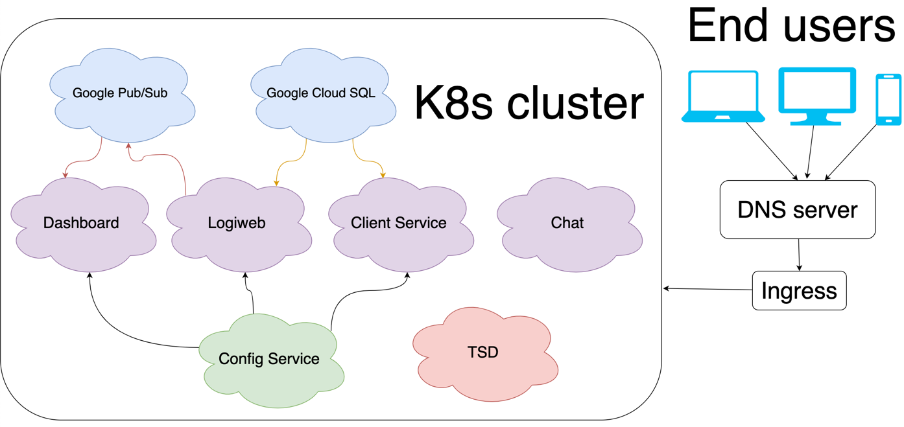

<h1 align="center">
 
 Summary
</h1>

##
Picking it up altogether, Logiweb microservices has grown up as big and complex project consisting of many components.
Frankly speaking, it was not easy to maintain the project alone, since it requires lost of efforts, 
but I am finally able to see the whole picture of how enterprise projects work.

This is what my project consists of:

## Future of the project

To be written...