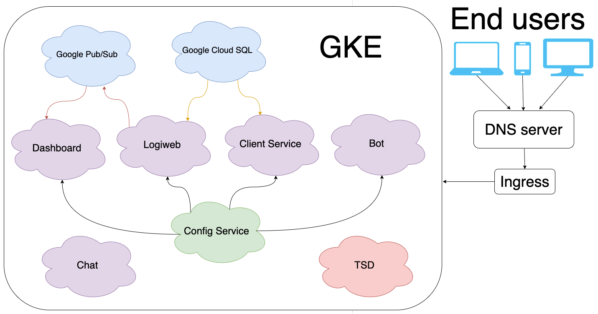

<h1 align="center">

 Summary
</h1>

##
Picking it up altogether, Logiweb microservices has grown up as big and complex project consisting of many components.
Frankly speaking, it was not easy to maintain the project alone, since it requires lost of efforts, 
but I am finally able to see the whole picture of how enterprise projects work.

This is what my project consists of:

## Future of the project
Now that I have REST endpoints and Google Cloud Support, my project can be easily scaled.
Unfortunately, I was pressed for time and didn't 
manage to implement all the functionality I wanted. Here's what my future plans are:

#### Technical support
The project is ready for production, yet the development is not finished. 
Now I need to support the project, so that users want to use it. This includes bug fixing & new functionality.

#### Mobile application
I don't reckon that users will be pleased to use only web application. 
Nowadays, the mobile app market occupies more than 70%, and the number is increasing.
Obviously, I'll need an Android/IOS application for my platform.

#### Cloud Provider
I only chose Google Cloud Platform for educational purposes. 
In real world, I need to consider choosing a cheap and reliable provider.
It's not necessary to migrate from Google at all, I just need to think it through and find out what the best choice is.